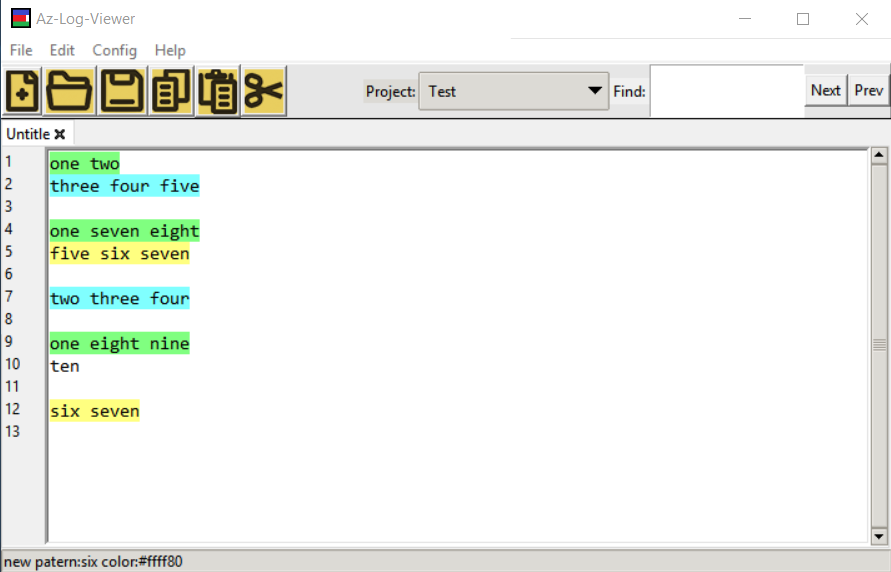
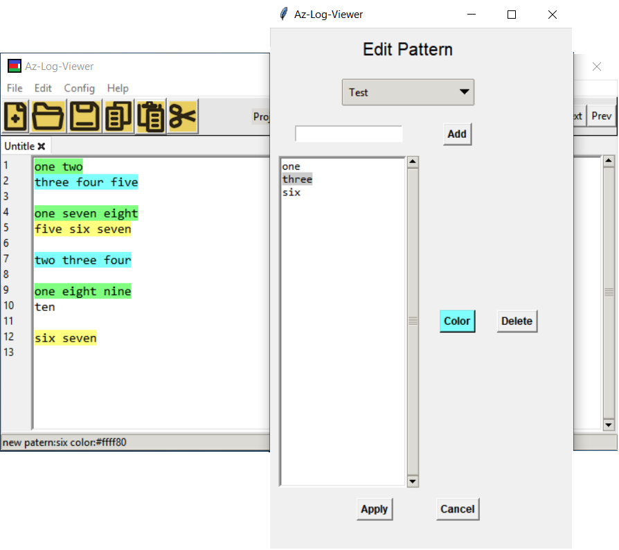

# AZ-log-Viewer

AZ-log-Viewer is a system for log visualization in real-time with remote synchronism:

## Features:

The system has the following features:
  * Line coloring through predefined patterns (text/color)
  * Organization of the patterns in a projects hierarchy
  * Remote synchronization for real-time logs
  * Basic text editing features
  

